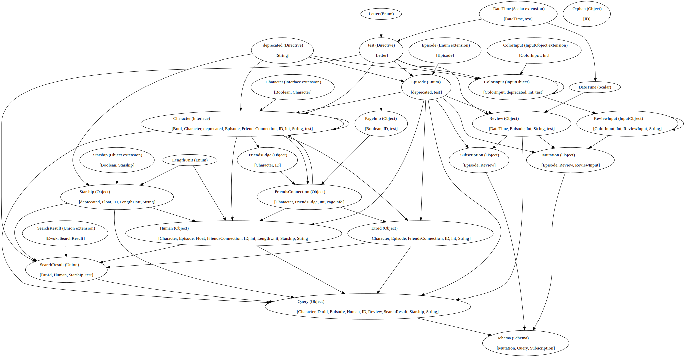

# CraftQL

> A CLI tool to manipulate GraphQL schemas and to output a graph data structure as a graphviz .dot format

## Installation

```sh
cargo install craftql
```

## Usage

```sh
USAGE:
    craftql [FLAGS] [OPTIONS] <path>

ARGS:
    <path>    Path to get files from

FLAGS:
    -h, --help       Prints help information
    -o, --orphans    Finds and display orphan(s) node(s)
    -V, --version    Prints version information

OPTIONS:
    -n, --node <node>         Finds and display one node
    -N, --nodes <nodes>...    Finds and display multiple nodes
```

### Output a graphviz .dot format

```sh
craftql tests/fixtures

digraph {
    0 [ label = "LengthUnit (Enum)" ]
    1 [ label = "Starship (Object)\l\l[ID, String, deprecated, String, LengthUnit, Float, Float]" ]
    2 [ label = "SearchResult (Union)\l\l[Human, Droid, Starship, test]" ]
    3 [ label = "SearchResult (Union extension)\l\l[Ewok, SearchResult]" ]
    4 [ label = "Character (Interface extension)\l\l[Boolean, Character]" ]
    5 [ label = "ColorInput (InputObject extension)\l\l[Int, ColorInput]" ]
    6 [ label = "Starship (Object extension)\l\l[Boolean, Starship]" ]
    7 [ label = "test (Directive)\l\l[Letter]" ]
    8 [ label = "DateTime (Scalar extension)\l\l[test, DateTime]" ]
    9 [ label = "Letter (Enum)" ]
    10 [ label = "Human (Object)\l\l[ID, String, String, LengthUnit, Float, Float, Character, Int, ID, FriendsConnection, Episode, Starship, Character]" ]
    11 [ label = "Droid (Object)\l\l[ID, String, Character, Int, ID, FriendsConnection, Episode, String, Character]" ]
    12 [ label = "FriendsConnection (Object)\l\l[Int, FriendsEdge, Character, PageInfo]" ]
    13 [ label = "FriendsEdge (Object)\l\l[ID, Character]" ]
    14 [ label = "PageInfo (Object)\l\l[ID, ID, Boolean, test]" ]
    15 [ label = "Review (Object)\l\l[Episode, test, Int, String, DateTime]" ]
    16 [ label = "DateTime (Scalar)" ]
    17 [ label = "Episode (Enum extension)\l\l[Episode]" ]
    18 [ label = "Character (Interface)\l\l[ID, String, Character, Int, ID, FriendsConnection, Episode, deprecated, Bool, test]" ]
    19 [ label = "deprecated (Directive)\l\l[String]" ]
    20 [ label = "schema (Schema)\l\l[Query, Mutation, Subscription]" ]
    21 [ label = "ReviewInput (InputObject)\l\l[Int, String, ColorInput]" ]
    22 [ label = "ColorInput (InputObject)\l\l[Int, Int, Int, deprecated, Int, test]" ]
    23 [ label = "Query (Object)\l\l[Episode, Character, Episode, Review, String, SearchResult, ID, Character, ID, Droid, ID, Human, ID, Starship]" ]
    24 [ label = "Mutation (Object)\l\l[Episode, ReviewInput, Review]" ]
    25 [ label = "Subscription (Object)\l\l[Episode, Review]" ]
    26 [ label = "Episode (Enum)\l\l[test, deprecated]" ]
    27 [ label = "Orphan (Object)\l\l[ID]" ]
    0 -> 10 [ ]
    18 -> 10 [ ]
    12 -> 10 [ ]
    26 -> 10 [ ]
    1 -> 10 [ ]
    4 -> 18 [ ]
    22 -> 21 [ ]
    6 -> 1 [ ]
    8 -> 7 [ ]
    8 -> 16 [ ]
    19 -> 1 [ ]
    0 -> 1 [ ]
    26 -> 25 [ ]
    15 -> 25 [ ]
    5 -> 22 [ ]
    3 -> 2 [ ]
    26 -> 23 [ ]
    18 -> 23 [ ]
    15 -> 23 [ ]
    2 -> 23 [ ]
    11 -> 23 [ ]
    10 -> 23 [ ]
    1 -> 23 [ ]
    9 -> 7 [ ]
    18 -> 13 [ ]
    7 -> 14 [ ]
    17 -> 26 [ ]
    19 -> 22 [ ]
    7 -> 22 [ ]
    18 -> 11 [ ]
    12 -> 11 [ ]
    26 -> 11 [ ]
    23 -> 20 [ ]
    24 -> 20 [ ]
    25 -> 20 [ ]
    13 -> 12 [ ]
    18 -> 12 [ ]
    14 -> 12 [ ]
    7 -> 26 [ ]
    19 -> 26 [ ]
    10 -> 2 [ ]
    11 -> 2 [ ]
    1 -> 2 [ ]
    7 -> 2 [ ]
    26 -> 24 [ ]
    21 -> 24 [ ]
    15 -> 24 [ ]
    26 -> 15 [ ]
    7 -> 15 [ ]
    16 -> 15 [ ]
    18 -> 18 [ ]
    12 -> 18 [ ]
    26 -> 18 [ ]
    19 -> 18 [ ]
    7 -> 18 [ ]
}
```



### Find and display one node

```sh
craftql tests/fixtures --node Character

# tests/fixtures/Types/Interfaces/Character.graphql
interface Character @test {
  id: ID!
  name: String!
  friends: [Character]
  friendsConnection(first: Int, after: ID): FriendsConnection!
  appearsIn: [Episode]!
  cute: Bool! @deprecated
}
```

### Find and display multiple nodes

```sh
craftql tests/fixtures --nodes Character Episode

# tests/fixtures/Types/Interfaces/Character.graphql
interface Character @test {
  id: ID!
  name: String!
  friends: [Character]
  friendsConnection(first: Int, after: ID): FriendsConnection!
  appearsIn: [Episode]!
  cute: Bool! @deprecated
}


# tests/fixtures/Types/Enums/Episode.gql
enum Episode @test(letter: B) {
  NEWHOPE @deprecated
  EMPIRE
  JEDI
}
```

### Find and display orphan(s) node(s)

```sh
craftql tests/fixtures --orphans

# tests/fixtures/Types/Types/orphan.gql
type Orphan {
  id: ID!
}
```

## TODO

- Add flag to list dependencies for a given node
- Add tests
- Add GitHub CI
- More to come!
